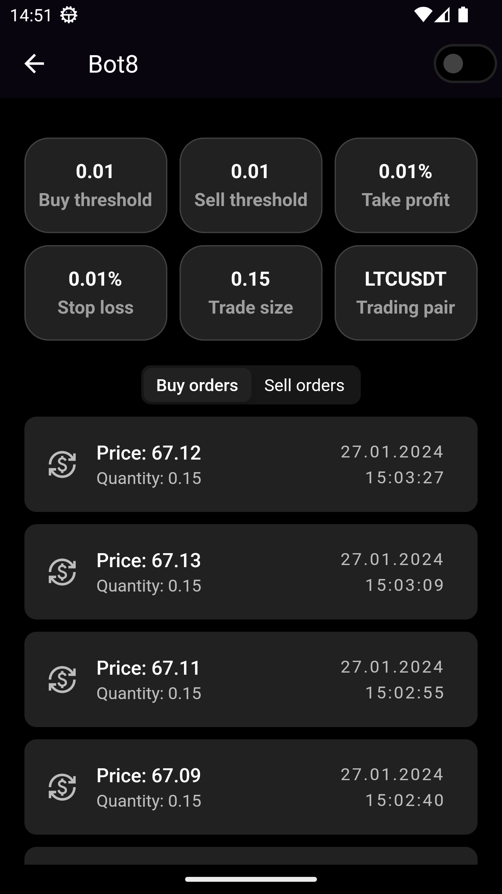

# TradeBit
This mobile crypto trading bot application is designed to automate cryptocurrency trading on the Binance platform. 
Leveraging advanced algorithms and real-time market analysis, it enables users to execute trades automatically, optimizing for profitability and risk management.
From executing trades manually to deploying sophisticated trading bots, our application empowers users to make informed decisions and automate their trading strategies.
## Table of Contents
- [Features](#features)
- [Technology Stack](#technology-stack)
- [Getting Started](#getting-started)
- [Team Contributions](#team-contributions)

## Features
- Authentication:
  - Secure and streamlined authentication process allowing users to easily sign in or sign up to access their personalized trading dashboard using JWT and Keycloak.
<br>
<p float="left">
  
   
  
</p>

- Connect Binance:
  - Simple Binance integration that enables users to link their Binance account for synchronized and secure trading activities.

<br>

<p float="left">
  
  
</p>

- User Wallet:
  - A clear and detailed view of the user's wallet, showcasing available balances across various cryptocurrencies.
  
<p float="left">
  
   
</p>

- Manual Trading:
  - Engage in manual trading with real-time market data and charts, giving users full control over their buy and sell operations.

<p float="left">
  
</p>

- Trading Bot Configuration:
  - Empower your trading strategy with custom bots. Set up your own trading bots specifying the name, buy/sell thresholds, profit targets, and more. Easily manage and review your fleet of bots from a comprehensive dashboard.

<p float="left">
  
  
</p>

- Cryptocurrency Price Prediction::
  - Each bot provides a visual chart that not only displays current price movements but also predicts future trends with a purple forecast line, helping you make informed decisions.
 
<p float="left">
  
</p>

- Automated Trading History:
  - Track your bot's trading performance with a detailed history of automated transactions. Each bot records its own series of executed buy and sell orders, providing transparent insights into its trading activity.

<p float="left">
  
</p>

- Real-Time Email Notifications:
  - Stay informed with real-time email notifications for account activities, including email verification, password resets, and order execution confirmations, ensuring you're always up-to-date with your trading bot's operations.

<p float="left">
  
  
  
  
</p>

- Cross-Platform Accessibility:
  - Thanks to the client application developed in Flutter, users can enjoy a consistent and responsive experience across all devices, ensuring they can trade anytime, anywhere.
  
## Technology Stack
- Spring Boot:
  - For creating a standalone, production-grade application.
- REST API:
  - Facilitates communication between the frontend application and the backend services.
- Spring Security & Keycloak:
  - For secure authentication and authorization.
- PostgreSQL:
  - Database for storing user and application data.
- RabbitMQ:
  - Messaging queue for handling asynchronous tasks and communication.
- Docker:
  - For containerizing the application and ensuring consistent environments.
- Binance API:
  - For executing trades and retrieving market data as well as user account data.

## Getting Started
### Backend
1. Clone the Repository
```
git clone https://github.com/bodyakyryliuk/TradeBit.git
```
2. Navigate to the server directory.
```
cd server
```
3. Use Docker to build and run the application:
```
docker-compose up --build
```

### Flutter Client
1. Navigate to the client directory
```
cd client
```
2. Install dependencies
```
flutter pub get
```
3. Run the flutter application
```
flutter run
```

## Team Contributions
Our project's success is attributed to the dedicated efforts of our talented team, each bringing specialized skills and expertise to the table. Here’s a breakdown of the roles and responsibilities:

### Bohdan Kyryliuk: 
- Spearheaded the development of the backend infrastructure, utilizing Spring Boot to create a robust and scalable system within microservices architecture.

### Sergiy Vergun: 
- Led the development of the client-side application, crafting a seamless and intuitive user interface with Flutter using clean architecture.

### Ilgin Sogut: 
- Focused on the integration and development of AI-powered prediction models for providing user
